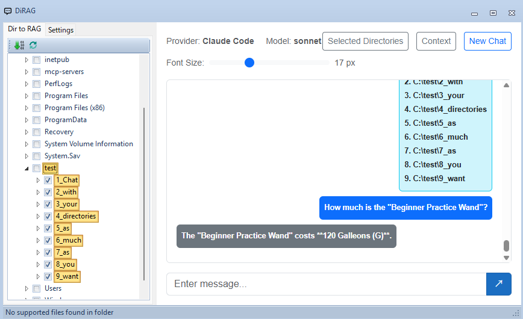

# DiRAG - One of the easiest ways to chat with directories



DiRAG is a Windows desktop application that provides an AI chat interface enhanced with Retrieval-Augmented Generation (RAG) capabilities. It allows you to have conversations with AI models while providing relevant context from your local documents and folders.

## Features

- **Multi-Provider Support**: Works with OpenAI-compatible APIs, Claude Code CLI, and custom providers
- **RAG Integration**: Automatically processes and indexes documents from selected folders to provide contextual information
- **Native Embedding Support**: Includes local embedding model support (Gemma) for offline RAG functionality without external API dependencies
- **Blazor WebView UI**: Modern web-based chat interface within a Windows Forms application
- **Document Processing**: Converts various document formats to markdown for better context understanding
- **Configurable Settings**: Customize API endpoints, models, embedding settings, and more
- **Folder Selection**: Choose specific directories to include in your knowledge base

## Prerequisites

- Windows 10 or later
- .NET 9.0 SDK
- Visual Studio 2022 (for building from source)
- Python 3.x
- uv

## Installation

### Build from Source

1. Clone the repository:
```bash
git clone https://github.com/straygizmo/DiRAG.git
cd DiRAG
```

2. Build the solution:
```bash
dotnet build .\DiRAG.sln
```

3. Output will be in `DiRAG\bin\Debug\net9.0-windows\`

## Python Tools Setup (Required)

Python tools are **required** for document processing, chunking, and embedding functionality. DiRAG uses Python for:
- Document conversion (MarkItDown)
- Text chunking and processing
- Embedding generation

### Setup Instructions

1. Navigate to the python_tools directory:
```bash
cd python_tools
```

2. Install dependencies using uv:
```bash
uv sync
```

This will install all necessary Python dependencies including:
- MarkItDown for document conversion (PDF, DOCX, etc.)
- Libraries for text chunking
- Embedding generation utilities

**Note**: Without proper Python tools setup, RAG functionality will not work correctly.

### API Provider Configuration

DiRAG supports multiple API providers:

#### OpenAI-Compatible APIs
- **Base URL**: Your API endpoint (e.g., `http://localhost:1234` for LM Studio)
- **API Key**: Your authentication key
- **Model**: The model to use (e.g., `gemma3`)

#### Claude Code CLI
- **CLI Path**: Path to Claude Code executable
- **Model**: Claude model identifier

### Embedding Configuration

For RAG functionality, configure embedding settings:
- **Embedding URL**: Endpoint for generating embeddings (e.g., `http://localhost:1234` for LM Studio)
- **Embedding Model**: Model for embeddings (e.g., `text-embedding-embeddinggemma-300m`)

#### GGUF Mode (Local Embedding)
You can use local GGUF embedding models by placing them in the following directory structure:
```
python_tools/models/embedding/[provider_name]/[modelfile_name].gguf
```

For example:
```
python_tools/models/embedding/unsloth/embeddinggemma-300M-Q8_0.gguf
```

This allows you to run embeddings locally without requiring an external API service.

### RAG Settings
- **Context Length**: Maximum context window size
- **Chunk Size**: Size of document chunks for processing
- **Chunk Overlap**: Overlap between consecutive chunks

## Usage

1. **Launch the Application**: Run `DiRAG.exe`

2. **Select Folders**: Use the folder tree on the left to select directories containing documents you want to include in your knowledge base

3. **Process Documents**: The application will automatically process and index documents from selected folders

4. **Start Chatting**: Type your questions in the chat interface. The AI will use both its training and the context from your documents to provide answers

5. **View Context**: Click the "Context" button to see what document chunks are being used for the current conversation

## Project Structure

```
DiRAG/
├── DiRAG/                      # Main application project
│   ├── Forms/                  # Windows Forms UI components
│   ├── Pages/                  # Blazor components
│   ├── Services/               # Business logic and services
│   │   ├── IChatService.cs     # Chat service interface
│   │   ├── IRagService.cs      # RAG service interface
│   │   ├── OpenAIChatService.cs
│   │   ├── ClaudeCodeChatService.cs
│   │   └── RagService.cs       # RAG implementation
│   ├── Models/                 # Data models
│   └── wwwroot/               # Web assets for Blazor
├── python_tools/              # Python utilities
│   └── convert_to_markdown.py # Document conversion tool
└── DiRAG.sln                  # Visual Studio solution file
```


## Contributing

Contributions are welcome! Please feel free to submit pull requests or open issues for bugs and feature requests.

## Troubleshooting

### Common Issues

1. **API Configuration Required**: Ensure you've configured at least one API provider in Settings
2. **Document Processing Fails**: Check that selected folders are accessible and contain supported file formats
3. **Embedding Errors**: Verify embedding API credentials and endpoint configuration

### Supported File Formats

**Text Files:**
- .txt, .md, .csv

**Code Files:**
- .py, .js, .ts, .jsx, .tsx
- .c, .cpp, .h, .java, .cs
- .go, .rs, .rb, .php
- .swift, .kt, .scala

**Configuration Files:**
- .json, .yaml, .yml
- .toml, .ini, .cfg

**Script Files:**
- .sh, .bat, .ps1, .sql

**Web Files:**
- .html, .css, .xml

**Office Documents** (requires python_tools):
- .pdf
- .docx, .doc
- .xlsx, .xls
- .pptx, .ppt

## License

MIT

## Third-Party Model Licenses

### Gemma Embedding Models

If you choose to use Gemma embedding models (e.g., text-embedding-embeddinggemma-300m) with this application, please note:

- Gemma models are provided by Google and are subject to their own [Terms of Use](https://ai.google.dev/gemma/terms)
- When distributing this software with Gemma models included, you must:
  - Provide notice to recipients that Gemma is subject to use restrictions
  - Include a copy of or link to the Gemma Terms of Use
  - Ensure compliance with the Prohibited Use Policy
  - Include prominent notices if model files are modified
- Commercial use is permitted but must comply with all terms and restrictions
- Models are provided "AS IS" without warranty

**Important**: Users are solely responsible for ensuring their use of Gemma models complies with Google's terms and applicable laws.

For full details, see: https://ai.google.dev/gemma/terms

## Acknowledgments

- Built with [Blazor WebView](https://docs.microsoft.com/en-us/aspnet/core/blazor/hybrid/)
- UI components from [Krypton Toolkit](https://github.com/Krypton-Suite/Standard-Toolkit)
- OpenAI integration using [OpenAI-DotNet](https://github.com/RageAgainstThePixel/OpenAI-DotNet)
- Document processing with [MarkItDown](https://github.com/microsoft/markitdown)
